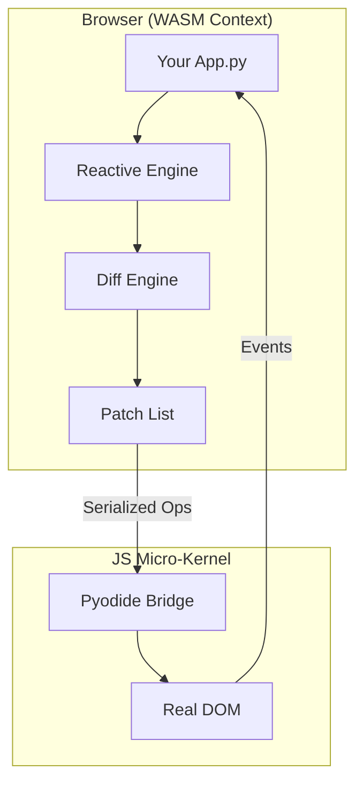

<div align="center">
  <h1>🧬 Evolve</h1>
  <p><strong>The Python-Native Frontend Framework</strong></p>
  
  <p>
    <a href="https://pypi.org/project/evolve/">
      
    </a>
    <a href="#">
      
    </a>
    <a href="LICENSE">
      
    </a>
  </p>

  <p>
    Build high-performance, reactive web applications entirely in Python.<br/>
    Powered by <strong>Pyodide (WASM)</strong> and a fine-grained <strong>Solid.js-style</strong> reactive engine.
  </p>
</div>

---

## 🚀 Overview

**Evolve** is a paradigm shift for Python web development. Unlike traditional frameworks that render HTML on the server (Django, Flask) or wrap heavy JS runtimes, Evolve runs **natively in the browser** via WebAssembly.

It features a **radical 2KB JavaScript micro-kernel** that handles DOM operations, while your application logic, state management, and component rendering happen entirely in Python.

### Why Evolve?

- **⚡ Zero Virtual DOM:** Uses fine-grained signals for direct DOM updates (O(1) complexity).
- **🐍 Python Native:** Write components, routing, and logic in pure Python.
- **📦 Tiny Bundle:** A minimal JS kernel coupled with an optimized Python environment.
- **🌐 Static Deployment:** Builds to pure HTML/CSS/WASM. Deploy to Vercel, Netlify, or GitHub Pages.

---

## 🛠 Installation

Requires Python 3.14+.

```bash
pip install evolve
````

-----

## ⚡ Quick Start

Get a reactive app running in seconds using the CLI.

### 1\. Initialize a Project

```bash
evolve init my-app
cd my-app
```

### 2\. Run the Dev Server

```bash
evolve run
```

Visit `http://localhost:3000` to see your app.

### 3\. Build for Production

```bash
evolve build
```

This compiles your Python code and assets into the `dist/` folder, ready for static hosting.

-----

## 🧩 The "Hello World" Component

Evolve uses a functional component syntax inspired by React but powered by Python.

`pages/home.py`:

```python
from evolve.router.router import page
from evolve.src.html import div, h1, button, p
from evolve.reactive.reactive import signal

@page("/")
def Home():
    # Reactive state (Signals)
    count = signal(0)

    def increment():
        count.set(count() + 1)

    return div(
        h1("Welcome to Evolve 🧬"),
        p(f"Current count is: {count()}"),
        button("Increment", on_click=lambda: increment()),
        style={"text-align": "center", "font-family": "sans-serif"}
    )
```

-----

## ✨ Key Features

### 1\. Fine-Grained Reactivity (Signals)

Evolve doesn't re-render entire components. When a `signal` changes, only the specific text node or attribute bound to it updates.

```python
from evolve.reactive.reactive import signal, computed

count = signal(0)
double = computed(lambda: count() * 2)

# Only this text node updates in the DOM
span(f"Double is: {double()}") 
```

### 2\. Built-in Routing

A lightweight, history-mode router is included out of the box.

```python
from evolve.router.router import page, Link

@page("/about")
def About():
    return div(
        h1("About Us"),
        Link("Go Home", to="/")
    )
```

### 3\. Tailwind-Style Styling

Evolve includes a `tw()` utility for rapid styling without leaving Python.

```python
from evolve.src.html import div, tw

div("Hello", **tw("text-white bg-blue-500 p-4 rounded-lg flex justify-center"))
```

### 4\. Component Lifecycle

Hook into mount and unmount events for side effects (API calls, subscriptions).

```python
from evolve.components.component import component
from evolve.core.lifecycle import on_mount, on_cleanup

@component
def Timer():
    on_mount(lambda: print("Component mounted!"))
    on_cleanup(lambda: print("Cleaned up!"))
    return div("Timer Component")
```

-----

## 🏗 Architecture

Evolve bridges the gap between Python and the Browser DOM using a highly efficient architecture:



1.  **Python Layer:** Calculates changes using Signals.
2.  **Diff Engine:** Generates a minimal list of DOM operations (patches).
3.  **JS Kernel:** A tiny JavaScript layer receives patches and applies them to the real DOM.

-----

## 📂 Project Structure

When you run `evolve init`, the following structure is created:

```text
my-app/
├── components/       # Reusable UI components
├── pages/            # Route handlers (@page)
├── public/           # Static assets (images, fonts)
├── evolve.zip        # Packed engine (generated on build)
└── app.py            # Entry point (auto-generated)
```

-----

## 🛣 Roadmap

  - [x] **v0.1:** Core Reactive Engine & JS Kernel
  - [x] **v0.1:** Component System & Routing
  - [x] **v0.1:** CLI (`init`, `build`, `run`)
  - [ ] **v0.2:** Global State Management (Store)
  - [ ] **v0.3:** Form Handling & Validation
  - [ ] **v0.4:** Server-Side Rendering (SSR) capabilities
  - [ ] **v1.0:** Full WASM Component Model Support

-----

## 🤝 Contributing

We welcome contributions\! Please see our [Contributing Guide](#) for details on how to set up the development environment.

1.  Fork the Project
2.  Create your Feature Branch (`git checkout -b feature/AmazingFeature`)
3.  Commit your Changes (`git commit -m 'Add some AmazingFeature'`)
4.  Push to the Branch (`git push origin feature/AmazingFeature`)
5.  Open a Pull Request

-----

## 📄 License

Distributed under the MIT License. See `LICENSE` for more information.
-----
